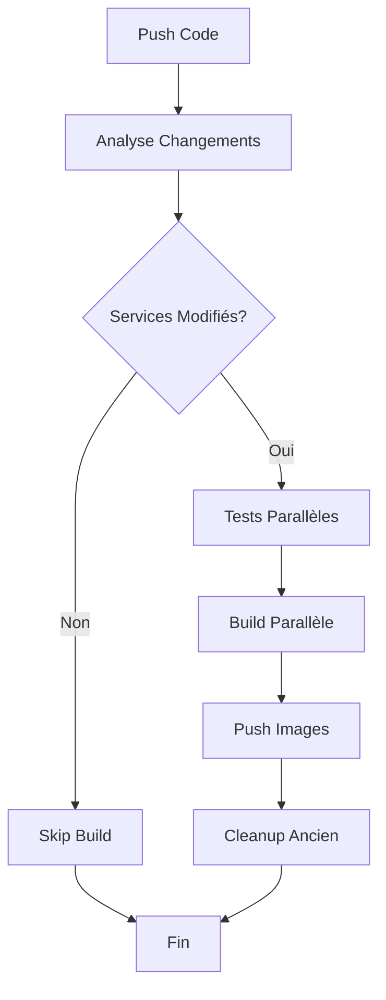

# 🤖 Build Intelligence System

Ce système de CI/CD optimisé ne reconstruit que les services dont les fichiers ont été modifiés.

## 🎯 Détection Automatique des Changements

### **Règles de Détection**

| Fichiers Modifiés | Service(s) Rebuilds |
|-------------------|-------------------|
| `translation/` | `translation-service` |
| `transcription/` | `transcription-service` |
| `speech/` | `speech-service` |
| `src/` ou `requirements.txt` | `translation-service` (legacy) |
| `.github/workflows/build.yml` | **Tous les services** |
| `runpod-config.json` | **Tous les services** |

### **Exemples de Scénarios**

#### ✅ **Modification du service de transcription**
```bash
git add transcription/src/inferences.py
git commit -m "amélioration du modèle Whisper"
git push origin main
```
**Résultat** : Seule l'image `transcription-service` est rebuildée

#### ✅ **Modification de plusieurs services**
```bash
git add translation/Dockerfile transcription/requirements.txt
git commit -m "mise à jour des dépendances"
git push origin main
```
**Résultat** : Images `translation-service` et `transcription-service` rebuildées

#### ✅ **Modification de la CI/CD**
```bash
git add .github/workflows/build.yml
git commit -m "amélioration du workflow"
git push origin main
```
**Résultat** : **Tous les services** rebuildés (sécurité)

#### ✅ **Aucun changement de service**
```bash
git add README.md
git commit -m "documentation"
git push origin main
```
**Résultat** : **Aucune image** rebuildée (optimisation)

## 🚀 Contrôle Manuel

### **Build Spécifique**
```bash
# Build seulement transcription
gh workflow run build.yml --field service=transcription

# Build seulement traduction
gh workflow run build.yml --field service=translation

# Build seulement speech
gh workflow run build.yml --field service=speech
```

### **Build Forcé (Tous)**
```bash
# Force rebuild de tous les services
gh workflow run build.yml --field service=all
```

### **Options Avancées**
```bash
# Build sans push (test local)
gh workflow run build.yml \
  --field service=transcription \
  --field push_image=false

# Build sans tests
gh workflow run build.yml \
  --field service=all \
  --field test_build=false
```

## 📊 Optimisations Appliquées

### **🔍 Analyse Intelligente**
- **Fetch complet** : `fetch-depth: 0` pour analyse précise
- **Comparaison robuste** : Gestion des nouvelles branches
- **Cache séparé** : Cache Docker indépendant par service

### **⚡ Performance**
- **Build parallèle** : Services buildés simultanément
- **Cache réutilisé** : Layers Docker mis en cache
- **Skip automatique** : Aucun build si pas de changements

### **🛡️ Sécurité**
- **Tests obligatoires** : Validation avant build
- **Rollback automatique** : Échec de build = pas de push
- **Isolation** : Échec d'un service n'affecte pas les autres

## 🏷️ Tags des Images

### **Stratégie de Tagging**
```
docker.io/username/service-service:latest
docker.io/username/service-service:main-abc1234
docker.io/username/service-service:run-123
docker.io/username/service-service:pr-45
```

### **Nettoyage Automatique**
- Garde les **3 dernières images** par service
- Supprime les tags `run-*` anciens
- Préserve `latest` et `main`

## 🔄 Workflow Complet



## 📈 Métriques d'Optimisation

- **🚀 Réduction du temps** : 60-80% sur les petits changements
- **💰 Économies** : Moins d'utilisation des runners GitHub
- **🔧 Maintenance** : Builds ciblés = debug plus facile
- **📦 Storage** : Moins d'images générées inutilement